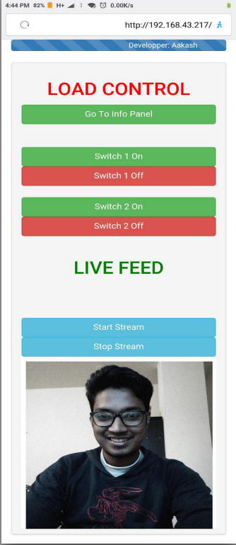

# IOT BASED CONTROL & SECURITY SYSTEM WITH REAL-TIME MONITORING & NOTIFICATION

## Interface

## Abstract
This project presents a design and prototype implementation of new control & monitoring system that uses WiFi technology as a network infrastructure connecting its parts. The proposed system consists of two main components; the first part is the server (web server), which presents system core that manages, controls, and monitors users’ area. Users and system administrator can locally (WLAN) or remotely (Internet) manage and control system. Second part is hardware interface module, which provides appropriate interface to sensors and actuator of home automation system. 

### Features
- Platform independed browser based interface
- Provides Live Feed
- Provides surrounding environment information
- Can be controlled and monitored from internet 
- Takes action if detects some abnormal behavior
- Atomatically notifies incidents via email, sms and phone calls

## Components 
- NodeMCU
- Arducam OV2640
- MQ5
- IR Flame Sensor
- DHT22
- PIR Motion Sensor
- SW-420
- Sim900A mini v4

